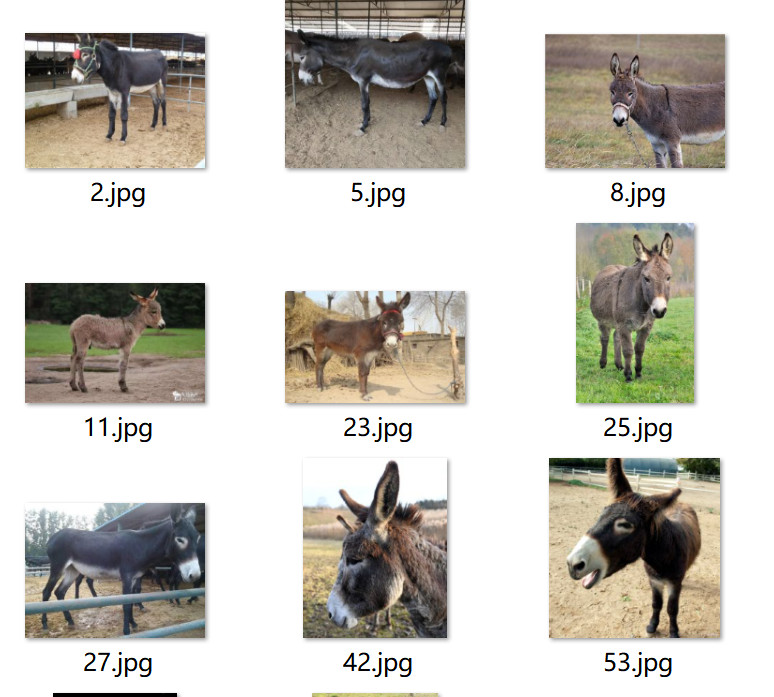
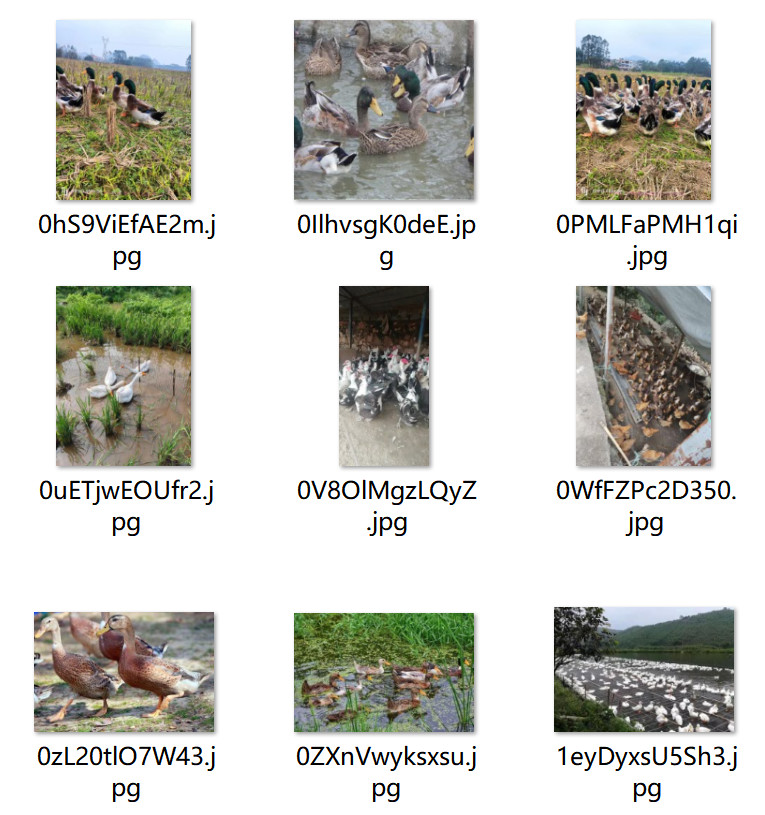
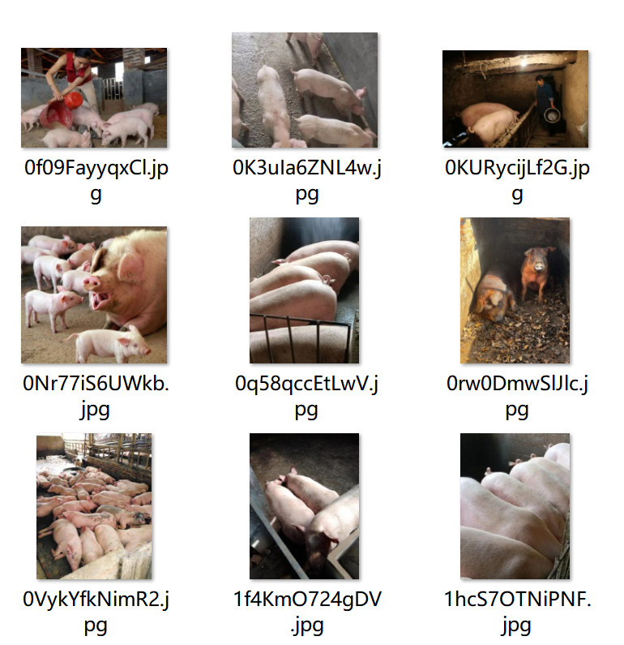

# Poultry (Donkey, Duck, Pig) - Image Classification Dataset

Dataset Information Introduction: The number of images in the folder "Pig" is 424.
The number of images in the folder "Donkey" is 548.
The number of images in the folder "Duck" is 439.
The total number of images in all subfolders is 1411.
If you have any questions to ask, just add them directly. I don't need your approval to respond to you, so you can send me messages directly. I can see them.
Search for me and send your questions all at once. I will reply to you, sometimes I am busy, you describe your question and intention clearly.
I will also reply to you when I am free, no need for formalities, which is more efficient.
Your phone number is also mentioned above, if I forget to reply to you or you are impatient, you can send a message or call.

## Images

Here is a pay link on Stripe ( https://buy.stripe.com/3cs8yP7sY87d0vu9AB ). Please contact me lonlonago@foxmail.com after funding $89, and I will send you a complete data files , thank you!

